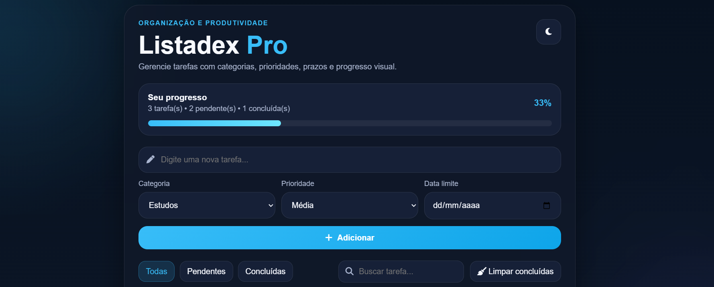

# TaskFlow Pro

Aplicação de lista de tarefas desenvolvida com **HTML, CSS e JavaScript**, com foco em produtividade, organização e experiência do usuário. O projeto foi construído para praticar manipulação do DOM, lógica de programação, armazenamento local e criação de interfaces mais completas e interativas no front-end.

## Sobre o projeto

O **TaskFlow Pro** foi desenvolvido como uma aplicação web de produtividade para gerenciar tarefas de forma prática e visual. A proposta do projeto foi evoluir de uma lista de tarefas simples para uma versão mais robusta, com recursos que aproximam a aplicação de um sistema real de organização pessoal.

Além da criação, conclusão e exclusão de tarefas, o projeto também inclui funcionalidades como filtros, busca, categorias, prioridade, data limite, barra de progresso, dark mode, drag and drop para reordenação e modal de confirmação para exclusão.
## Preview



[Ver projeto online](https://dexart2026.github.io/Listadex/)

## Funcionalidades

- Adicionar novas tarefas
- Editar tarefas existentes
- Marcar tarefas como concluídas
- Excluir tarefas
- Modal de confirmação antes da exclusão
- Filtrar por:
  - Todas
  - Pendentes
  - Concluídas
- Buscar tarefas em tempo real
- Definir categoria da tarefa
- Definir prioridade da tarefa
- Adicionar data limite
- Reordenar tarefas com drag and drop
- Visualizar progresso por meio de barra de progresso
- Alternar entre dark mode e light mode
- Persistência de dados com `localStorage`

## Tecnologias utilizadas

- **HTML5**
- **CSS3**
- **JavaScript**
- **localStorage**
- **Drag and Drop API**
- **Font Awesome**

## Estrutura do projeto

```text
taskflow-pro/
├── index.html
├── style.css
├── script.js
└── imagens/
